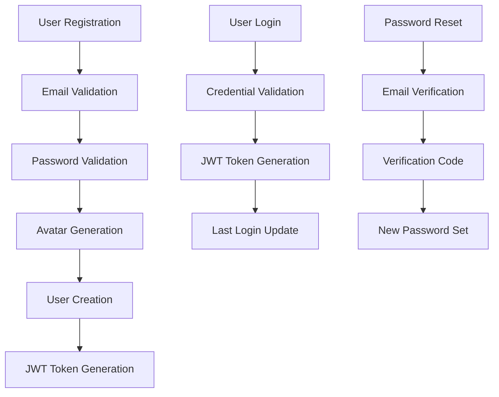

# User Authentication App

<div align="center">
  <h2>🔐 XBooking User Management & Authentication System</h2>
  <p><strong>Secure, scalable authentication for the XBooking workspace booking platform</strong></p>
  
  
  
  
  
</div>

## 📋 Overview

The User app is the authentication and user management core of the XBooking platform. It handles secure user registration, login, profile management, and password recovery with email verification for the workspace booking system.

### 🎯 Purpose
This app manages all user-related functionality for the XBooking platform, enabling secure access to workspace booking features, profile management, and account recovery.

### 🔑 Key Features
- **Secure Registration** - Email-based user registration with password validation
- **JWT Authentication** - Token-based authentication for API access
- **Profile Management** - Complete user profile system with avatar generation
- **Password Recovery** - Email verification code system for password reset
- **Admin Integration** - Enhanced admin interface for user management
- **Email Verification** - Secure email-based account verification
- **Avatar Generation** - Automatic profile picture creation via DiceBear API

## 🏗️ Architecture

### Models
```python
# Custom User Model with UUID primary keys
class User(AbstractUser):
    id = models.UUIDField(primary_key=True, default=uuid.uuid4, editable=False)
    email = models.EmailField(unique=True)
    full_name = models.CharField(max_length=255)
    avatar_url = models.URLField(blank=True, null=True)
    is_verified = models.BooleanField(default=False)
    verification_code = models.CharField(max_length=6, blank=True, null=True)
    created_at = models.DateTimeField(auto_now_add=True)
    updated_at = models.DateTimeField(auto_now=True)
```

### Authentication Flow


## 🚀 API Endpoints

### Authentication Endpoints

#### 1. User Registration
```http
POST /api/user/register/
Content-Type: application/json

{
  "full_name": "John Doe",
  "email": "john.doe@example.com",
  "password": "SecurePass123!",
  "confirm_password": "SecurePass123!"
}
```

**Response:**
```json
{
  "success": true,
  "message": "User registered successfully",
  "data": {
    "user": {
      "id": "550e8400-e29b-41d4-a716-446655440000",
      "email": "john.doe@example.com",
      "full_name": "John Doe",
      "avatar_url": "https://api.dicebear.com/7.x/initials/svg?seed=JD",
      "is_verified": false,
      "created_at": "2024-01-15T10:30:00Z"
    },
    "tokens": {
      "access": "eyJ0eXAiOiJKV1QiLCJhbGciOiJIUzI1NiJ9...",
      "refresh": "eyJ0eXAiOiJKV1QiLCJhbGciOiJIUzI1NiJ9..."
    }
  }
}
```

#### 2. User Login
```http
POST /api/user/login/
Content-Type: application/json

{
  "email": "john.doe@example.com",
  "password": "SecurePass123!"
}
```

**Response:**
```json
{
  "success": true,
  "message": "Login successful",
  "data": {
    "user": {
      "id": "550e8400-e29b-41d4-a716-446655440000",
      "email": "john.doe@example.com",
      "full_name": "John Doe",
      "avatar_url": "https://api.dicebear.com/7.x/initials/svg?seed=JD",
      "last_login": "2024-01-15T14:30:00Z"
    },
    "tokens": {
      "access": "eyJ0eXAiOiJKV1QiLCJhbGciOiJIUzI1NiJ9...",
      "refresh": "eyJ0eXAiOiJKV1QiLCJhbGciOiJIUzI1NiJ9..."
    }
  }
}
```

#### 3. Password Reset Request
```http
POST /api/user/password-reset/
Content-Type: application/json

{
  "email": "john.doe@example.com"
}
```

**Response:**
```json
{
  "success": true,
  "message": "Password reset code sent to your email",
  "data": {
    "email": "john.doe@example.com",
    "code_expires_in": "15 minutes"
  }
}
```

#### 4. Password Reset Confirmation
```http
POST /api/user/password-reset-confirm/
Content-Type: application/json

{
  "email": "john.doe@example.com",
  "verification_code": "123456",
  "new_password": "NewSecurePass123!"
}
```

**Response:**
```json
{
  "success": true,
  "message": "Password reset successful",
  "data": {
    "message": "Your password has been updated successfully"
  }
}
```

### Profile Management Endpoints

#### 5. Get User Profile
```http
GET /api/user/profile/
Authorization: Bearer <access_token>
```

#### 6. Update User Profile
```http
PUT /api/user/profile/
Authorization: Bearer <access_token>
Content-Type: application/json

{
  "full_name": "John Smith",
  "avatar_url": "https://custom-avatar-url.com/avatar.jpg"
}
```

## 🔒 Security Features

### Password Security
- **PBKDF2 Hashing** - Industry-standard password hashing
- **Complex Validation** - Minimum 8 characters, uppercase, lowercase, digit, special character
- **No Plain Text Storage** - Passwords never stored in plain text
- **Secure Reset Process** - Time-limited verification codes

### JWT Token Security
- **Short-lived Access Tokens** - 60-minute expiration
- **Refresh Token Rotation** - 7-day refresh token lifetime
- **Secure Signing** - HMAC SHA-256 algorithm
- **Token Validation** - Comprehensive token verification

### Email Verification
- **6-Digit Codes** - Secure random verification codes
- **Time Expiration** - 15-minute code validity
- **Single Use** - Codes invalidated after use
- **Rate Limiting** - Protection against spam requests

## 📁 App Structure

```
user/
├── __init__.py
├── apps.py                    # App configuration
├── models.py                  # User model definition
├── admin.py                   # Enhanced admin interface
├── forms.py                   # Admin forms
├── urls.py                    # URL routing
├── view.py                    # Legacy views (deprecated)
├── serializers/               # API serializers
│   ├── __init__.py
│   └── registration.py        # User registration serializer
├── validators/                # Data validation
│   ├── __init__.py
│   └── registration.py        # Password validation logic
├── views/                     # API endpoints
│   ├── __init__.py
│   ├── registration.py        # Registration endpoint
│   ├── login.py              # Login endpoint
│   └── password_reset.py     # Password reset endpoints
├── templates/                 # Email templates
│   └── user/
│       ├── password_reset_email.html
│       └── verification_email.html
├── migrations/               # Database migrations
│   ├── __init__.py
│   └── 0001_initial.py
└── tests/                    # Comprehensive test suite
    ├── __init__.py
    ├── README.md            # Test documentation
    ├── registration/        # Registration tests
    │   ├── __init__.py
    │   ├── test_unit.py
    │   ├── test_api.py
    │   └── test_integration.py
    └── login/              # Login tests
        ├── __init__.py
        ├── test_unit.py
        ├── test_api.py
        └── test_integration.py
```

## 🧪 Testing

### Test Coverage
The User app includes comprehensive test coverage:

- ✅ **Unit Tests** - Model methods, serializer validation, helper functions
- ✅ **API Tests** - HTTP endpoints, status codes, response formats
- ✅ **Integration Tests** - End-to-end authentication flows
- ✅ **Security Tests** - Password hashing, token validation
- ✅ **Validation Tests** - Input validation, error handling

### Running Tests

```bash
# Run all user app tests
python manage.py test user.tests

# Run specific test categories
python manage.py test user.tests.registration    # Registration tests
python manage.py test user.tests.login          # Login tests

# Run specific test types
python manage.py test user.tests.registration.test_unit        # Unit tests
python manage.py test user.tests.registration.test_api         # API tests
python manage.py test user.tests.registration.test_integration # Integration tests

# Use custom test runner
python run_tests.py
```

### Test Scenarios

#### Registration Tests
- ✅ Valid user creation with all fields
- ✅ Password validation and hashing
- ✅ Email uniqueness validation
- ✅ Avatar URL generation
- ✅ JWT token generation
- ✅ Error handling for invalid data

#### Login Tests
- ✅ Successful authentication
- ✅ Invalid credential handling
- ✅ Inactive user restrictions
- ✅ Last login timestamp update
- ✅ JWT token generation
- ✅ Security validations

#### Password Reset Tests
- ✅ Verification code generation
- ✅ Email sending functionality
- ✅ Code validation and expiration
- ✅ Password update process
- ✅ Security measures

## 🔧 Configuration

### User Model Settings
```python
# settings.py
AUTH_USER_MODEL = 'user.User'

# JWT Configuration
SIMPLE_JWT = {
    'ACCESS_TOKEN_LIFETIME': timedelta(minutes=60),
    'REFRESH_TOKEN_LIFETIME': timedelta(days=7),
    'ROTATE_REFRESH_TOKENS': True,
    'BLACKLIST_AFTER_ROTATION': True,
}

# Password Validation
AUTH_PASSWORD_VALIDATORS = [
    {
        'NAME': 'django.contrib.auth.password_validation.UserAttributeSimilarityValidator',
    },
    {
        'NAME': 'django.contrib.auth.password_validation.MinimumLengthValidator',
        'OPTIONS': {'min_length': 8,}
    },
    {
        'NAME': 'django.contrib.auth.password_validation.CommonPasswordValidator',
    },
    {
        'NAME': 'django.contrib.auth.password_validation.NumericPasswordValidator',
    },
]
```

### Email Configuration
```python
# Email Backend for Production
EMAIL_BACKEND = 'django.core.mail.backends.smtp.EmailBackend'
EMAIL_HOST = 'smtp.gmail.com'
EMAIL_PORT = 587
EMAIL_USE_TLS = True
EMAIL_HOST_USER = 'your-email@gmail.com'
EMAIL_HOST_PASSWORD = 'your-app-password'

# Development Email Backend
EMAIL_BACKEND = 'django.core.mail.backends.console.EmailBackend'
```

### Avatar Generation
```python
# DiceBear API Configuration
DICEBEAR_API_URL = 'https://api.dicebear.com/7.x/initials/svg'
AVATAR_STYLES = ['initials', 'avataaars', 'personas']
```

## 🚀 Usage Examples

### Django Views Integration
```python
from django.contrib.auth import get_user_model
from rest_framework.decorators import api_view, permission_classes
from rest_framework.permissions import IsAuthenticated

User = get_user_model()

@api_view(['GET'])
@permission_classes([IsAuthenticated])
def get_user_profile(request):
    user = request.user
    return Response({
        'id': user.id,
        'email': user.email,
        'full_name': user.full_name,
        'avatar_url': user.avatar_url,
    })
```

### Frontend Integration
```javascript
// Registration
const registerUser = async (userData) => {
  const response = await fetch('/api/user/register/', {
    method: 'POST',
    headers: {
      'Content-Type': 'application/json',
    },
    body: JSON.stringify(userData),
  });
  
  const data = await response.json();
  
  if (data.success) {
    // Store tokens
    localStorage.setItem('access_token', data.data.tokens.access);
    localStorage.setItem('refresh_token', data.data.tokens.refresh);
    
    // Redirect to dashboard
    window.location.href = '/dashboard/';
  }
};

// Login
const loginUser = async (credentials) => {
  const response = await fetch('/api/user/login/', {
    method: 'POST',
    headers: {
      'Content-Type': 'application/json',
    },
    body: JSON.stringify(credentials),
  });
  
  const data = await response.json();
  
  if (data.success) {
    localStorage.setItem('access_token', data.data.tokens.access);
    localStorage.setItem('refresh_token', data.data.tokens.refresh);
    return data.data.user;
  }
  
  throw new Error(data.message);
};

// Authenticated API calls
const makeAuthenticatedRequest = async (url, options = {}) => {
  const token = localStorage.getItem('access_token');
  
  return fetch(url, {
    ...options,
    headers: {
      ...options.headers,
      'Authorization': `Bearer ${token}`,
      'Content-Type': 'application/json',
    },
  });
};
```

## 🔄 Data Flow

### Registration Flow
1. **User Input** → Frontend form submission
2. **Validation** → Server-side data validation
3. **Password Hash** → PBKDF2 password hashing
4. **Avatar Generation** → DiceBear API call for avatar
5. **User Creation** → Database user record creation
6. **JWT Generation** → Access and refresh token creation
7. **Response** → User data and tokens returned

### Login Flow
1. **Credentials** → Email and password submission
2. **Authentication** → Password verification
3. **User Lookup** → Database user retrieval
4. **JWT Generation** → New token pair creation
5. **Last Login** → Timestamp update
6. **Response** → User data and tokens returned

### Password Reset Flow
1. **Email Request** → Password reset initiation
2. **Code Generation** → 6-digit verification code
3. **Email Dispatch** → Code sent to user email
4. **Code Verification** → User submits code and new password
5. **Password Update** → New password hash storage
6. **Confirmation** → Success response

## 🛡️ Security Best Practices

### Implementation Guidelines
- **Never log passwords** - Passwords should never appear in logs
- **Validate all inputs** - Use serializers for data validation
- **Rate limit endpoints** - Prevent brute force attacks
- **Use HTTPS** - Encrypt all communication
- **Token rotation** - Implement refresh token rotation
- **Secure headers** - Include security headers in responses

### Common Security Patterns
```python
# Input sanitization
def clean_email(self, email):
    return email.lower().strip()

# Rate limiting (using django-ratelimit)
@ratelimit(key='ip', rate='5/m', method='POST')
def login_view(request):
    # Login logic
    pass

# Password strength validation
def validate_password_strength(password):
    if len(password) < 8:
        raise ValidationError("Password must be at least 8 characters")
    # Additional checks...
```

## 📈 Monitoring & Analytics

### Key Metrics to Track
- **Registration Rate** - New user signups per day/week
- **Login Success Rate** - Successful vs failed login attempts
- **Password Reset Requests** - Frequency of password resets
- **Token Usage** - API endpoint usage patterns
- **Error Rates** - Authentication failure patterns

### Logging Configuration
```python
LOGGING = {
    'version': 1,
    'disable_existing_loggers': False,
    'handlers': {
        'file': {
            'level': 'INFO',
            'class': 'logging.FileHandler',
            'filename': 'user_app.log',
        },
    },
    'loggers': {
        'user': {
            'handlers': ['file'],
            'level': 'INFO',
            'propagate': True,
        },
    },
}
```

## 🔄 Future Enhancements

### Planned Features
- [ ] **Two-Factor Authentication** - SMS and TOTP support
- [ ] **Social Login** - Google, Facebook, GitHub integration
- [ ] **Account Verification** - Email verification for new accounts
- [ ] **Role-based Permissions** - User roles and permissions system
- [ ] **Activity Logging** - User activity tracking and audit trails
- [ ] **API Rate Limiting** - Advanced rate limiting per user
- [ ] **Password Policy** - Configurable password policies
- [ ] **Session Management** - Active session monitoring and control

### Integration Points
- **Workspace App** - User authentication for booking system
- **Payment App** - User verification for payment processing
- **Notification App** - User preferences and communication
- **Analytics App** - User behavior tracking and insights

## 🤝 Contributing

### Development Guidelines
1. Follow Django best practices
2. Write comprehensive tests for new features
3. Document all API endpoints
4. Use type hints where appropriate
5. Follow PEP 8 coding standards

### Adding New Features
1. Create feature branch from `main`
2. Implement feature with tests
3. Update documentation
4. Submit pull request
5. Code review and merge

## 📞 Support

### Authentication Issues
- Check JWT token expiration
- Verify email and password format
- Review API endpoint documentation
- Check server logs for errors

### Common Problems
- **401 Unauthorized** - Check token validity and format
- **400 Bad Request** - Validate request data format
- **429 Too Many Requests** - Implement request throttling
- **500 Internal Server Error** - Check server logs and configuration

---

<div align="center">
  <p><strong>🔐 Secure Authentication for the XBooking Platform</strong></p>
  <p>Built with Django REST Framework and JWT</p>
</div>
